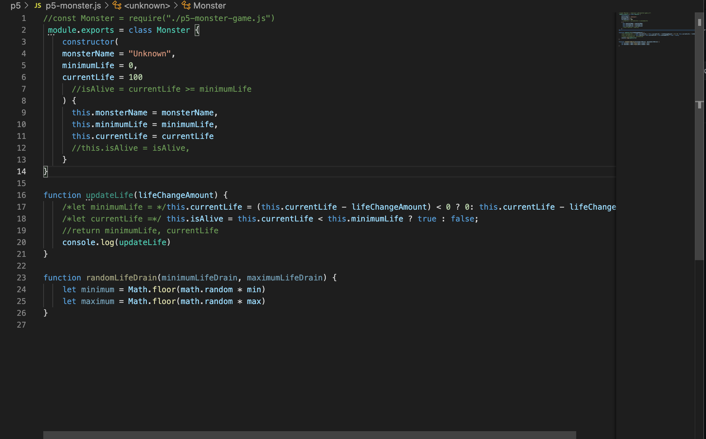

## Welcome to Project 5

This weeks project was credit credit. Our professor gave us a good portion of the code and we had to finish the rest. This project was a bit different from the others since it was a Moster game. We had to figure out how to show each monsters life and after every attack if it would lose power or die.

After completing this project, you will:

Gain experience working with classes, including class constructors and methods

Gain experience interpreting existing code to design a new class, including constructor and methods

Gain more experience working with code modules

Gain experience executing and debugging Node.js code using VSCode, including module breakpoints

Gain more experience working with Array map() and forEach() methods

Gain experience working with the concept of a gaming loop

Gain more experience working with objects and arrays

Here is a portion of my code I did. Unfortunately I was not able to complete the project.

